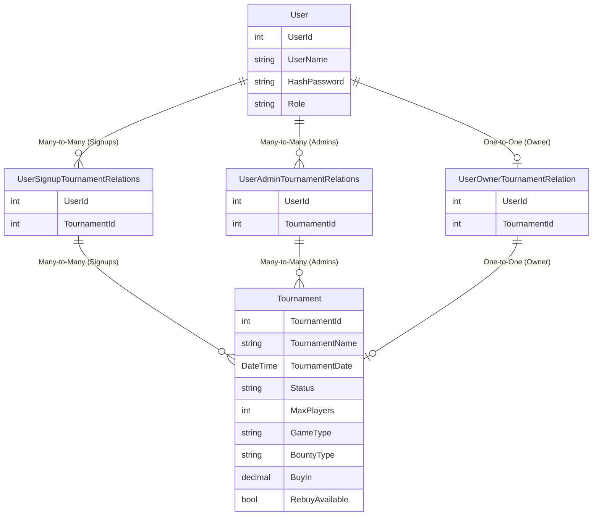
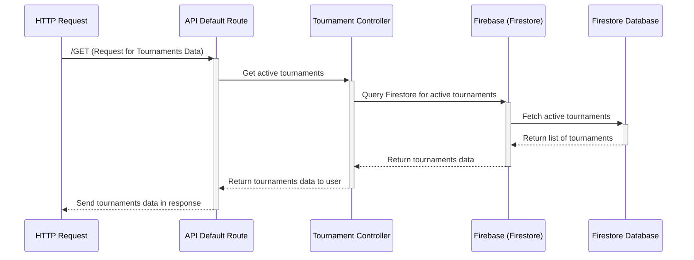

_Poker Club Turnamnet Manager_

# What do we want to achieve?

Project to create a tournament manager for a Poker Club. Only admin users (i.e., club managers) will have the ability to create tournaments. Regular users will be able to sign up for tournaments created by the admins, participate, and view details of ongoing or past tournaments.

## User Roles:

1.Admin Users "Floor"( +Club Managers):
-Can create, update, and delete tournaments.
-Can add and remove players to/from tournaments.
-Can assign tournaments as "active", "ongoing", or "completed".

2.Other Users (Players):
-Can sign up for tournaments created by admins.
-Can view details about tournaments (e.g., players, status, etc.).
-Can withdraw from a tournament if they decide not to participate

### Data managment

1.User Registration and Authentication:

-Admins and regular users will need to sign up and log in using an email and password.
-Admins will have additional rights to create and manage tournaments.

2.Tournament Information:

-Name of the tournament.
-Date and time of the tournament
-Which game: nlh, nlh6max plo, plo5, RoE (checkbox)
-Bounty ? standard/progressive/mystery (checkbox)
-Additional information like buy-in, late registration,
-Bounty ? standard/progressive/mystery (checkbox)
-Maximum number of players allowed in the tournament.
-Current list of players signed up.
-Status of the tournament (e.g., "planned", " late reg." ,"ongoing", "completed").
-Information if rebuy will be avaiable

#### Frontend (View): (HTML, CSS, JavaScript)

1.Login Page

Users must log in with their credentials. Admin users will be identified and given access to create and manage tournaments automatically.

2.Home Page:

*Displays a list of tournaments created by admins.
*If a user is an admin, they will have a button to create a new tournament.
\*If a user is a regular player, they can only see tournaments they can join. ( see details button----> turnament detail modal + join btn )

3.Tournament Details Page: (modal?)

\**Displays details about a specific tournament.
*Allows players to sign up or withdraw.
*Shows the current player list and status (planned,late reg., ongoing, completed).
*Admin will be able to add/remove players (and post results at the end?)

4.Tournament Creation Page (For Admin ):

Admins can enter details like tournament name, date/time, max players, and status.
Admins can submit the form to create a new tournament.

#### Backend :

1. User Authentication Controller

-Handle user login and registration.
-Verify user credentials with Firebase Authentication.
-Redirect users to appropriate dashboards (Admin View or Player View).

2. Tournament Management Controller (Admin Role)
   -Enable admins to create, update, and delete tournaments.
   -Manage player lists by adding or removing players.
   -Change tournament statuses (planned, ongoing, completed).
   -Validate tournament details before saving to the database.
   -Update Firestore with new or modified tournament data.
   -Fetch updated tournament lists and display them to the admin view.

3. Player Interaction Controller (Player Role)
   -Allow players to sign up for tournaments, view tournament details, or withdraw from participation.
   -Check for tournament capacity before allowing player sign-up.
   -Update player lists in the Firestore database.

##### Models and Data Flow:

1.User Model:

username: Unique identifier for the user.
email: User's email address.
password: Hashed password stored securely.
role: "admin" or "user". Admins can create tournaments, while regular users can only sign up for them.

2.Tournament Model:

name: Name of the tournament.
date: Date and time of the tournament.
maxPlayers: Maximum number of players allowed in the tournament.
status: "planned", "ongoing","late registration" or "completed".
players: List of player IDs who have signed up for the tournament.
creatorId: ID of the user who created the tournament (should be an admin).
gameType:Type of the game in the tournament. Options could be "NLH", "NLH6max", "PLO", "PLO5", "RoE".
bountyType: Type of bounty in the tournament. Options could be "standard", "progressive", "mystery".
buyIn: The buy-in amount for the tournament .
rebuyAvaiable: Yes/No information

/example/
const tournamentExample = {
name: " Winter Circut 2025 NLH",
date: "15-03-2025 19:00",
maxPlayers: 100,
status: "planned",
players: ["player1", "player2", "player3"],
creatorId: "admin123",
gameType: "NLH",
bountyType: "progressive",
buyIn: 100
rebuyAvailable: true,
};

###### Additional information

*A regular user can sign up for multiple tournaments.
*An admin user can create and manage multiple tournaments.
\*A tournament can have many players but only one creator (the admin).

---

## DIAGRAMS/CHARTS

# Entity-relation diagram for database relationships:

## Data Flow Diagram

